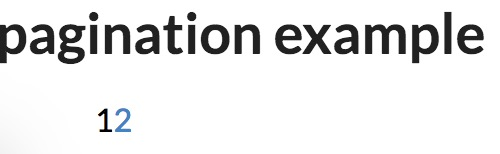

# pagination
使用jquary 的一个简单的分页函数 showPage
使用到了semantic-ui，可以参考example.html
```
参数：
    curPage： 当前页数，必填
    totalPage： 总页数，必填
    conut：   每页显示的条目数量，可选，默认为10条
```
1.当总页数小于等于2时，显示所有页数，不现实左右标签  
  

2.当总页数大于2小于5时，显示所有页数以及左右标签
  

3.当总页数大于5时，显示省略号，首尾一定显示，其他根据情况靠近或者在中间显示
  
 
 

 

